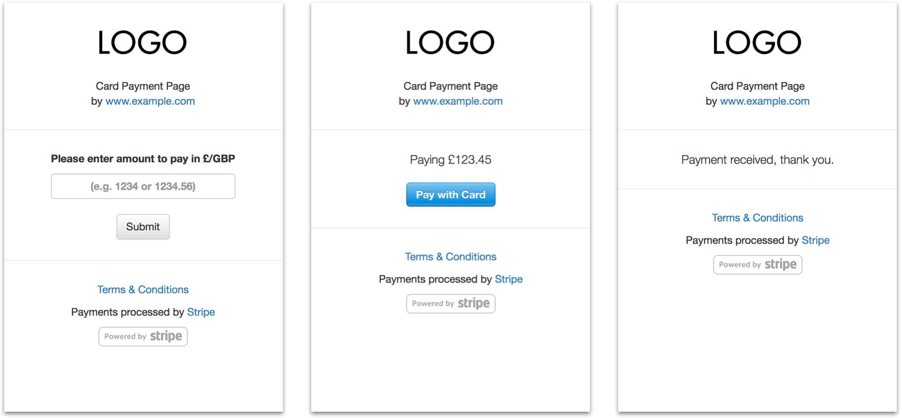

# Obsoleted by <a href="https://stripe.com/gb/payments/payment-links">Stripe Payment Links</a> (2021)

---

# Super Simple Stripe Checkout

Simple server and website to accept Stripe payments.




# How to Use

The applicaiton requires:

- A server supporting Node.js v4x or later
- A valid SSL certificate for `https://` connections (or head straight to Heroku, which comes SSL-enabled by default)
- A Stripe account. D'oh.

Setting up should only take about 10 to 15 min if all basic bits are in place.

## Functionality

Once the app is up and running, there are a couple of ways to use it.

### 1. By letting your customer type the amount payable by themselves
Just head to `https://www.example.com/` (home page), type a value and press Submit.

### 2. By sending a link with a pre-set amount to be paid
Send a link like `https://www.example.com/pay/1,234.99`. This will take your customer straight to the second step of the payment process.

## Configuration

Set your Stripe API keys.

These can go in `config.json` file in the root directory of the app, or set as `ENV` variables on your server or on Heroku.

```js
{
    "SECRET": "sk_test_abcdef1234567890",
    "PUBLISHABLE": "pk_test_abcdef1234567890",
}
```

You can also set the `TEST` option to `true` to enable local testing without SSL (`https://`).

## Customization

Remember to customise a few important things.

### Currency

The app is set to use `GBP` by default. You should change this to your preferred currency in the follwing places:

- `index.js`
- `views/index.pug`
- `views/pay.pug`

### Identity

Make sure you set your name or company in:

- `views/layout.pug`
- `views/pay.pug`

Your logo should also replace the files in:

- `public/images/logo.png` (324x158)
- `public/images/stripe-logo.png` (128x128, round-cropped)

<hr/>

I guess that's it?

# License

The code in this repository is licensed for use by anyone under the terms of the MIT license.


